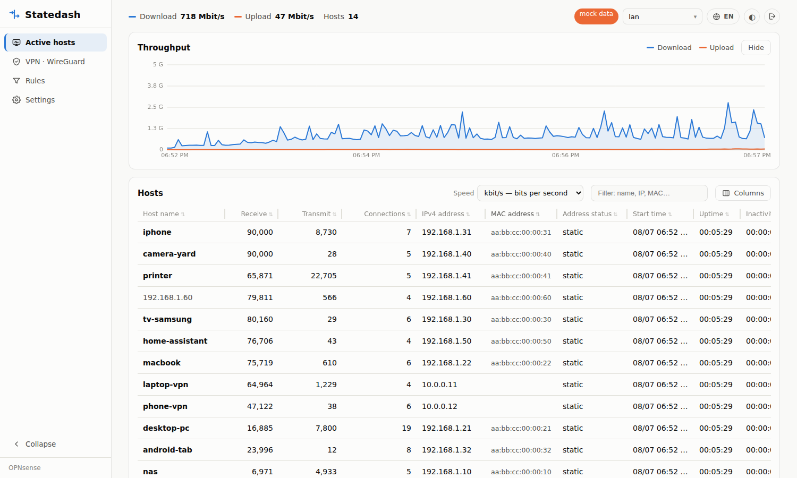
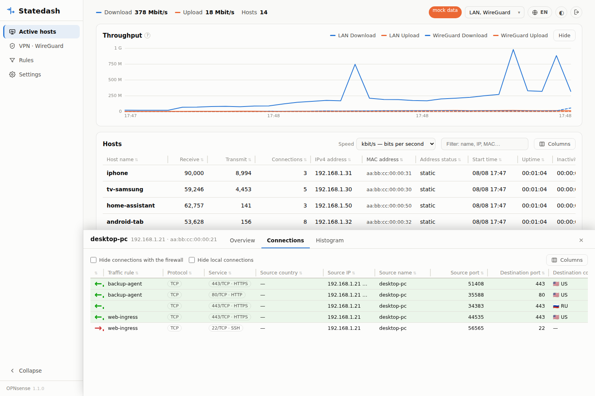
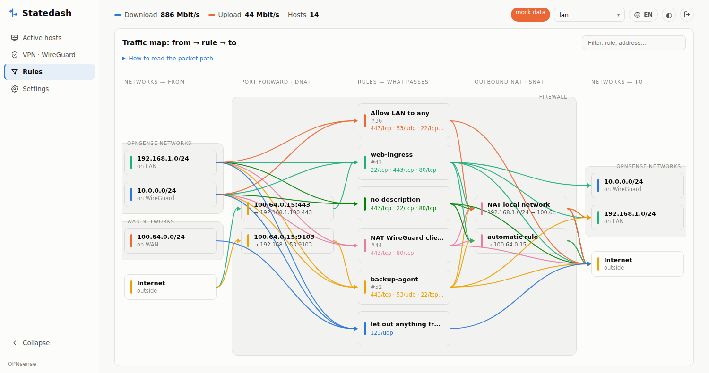
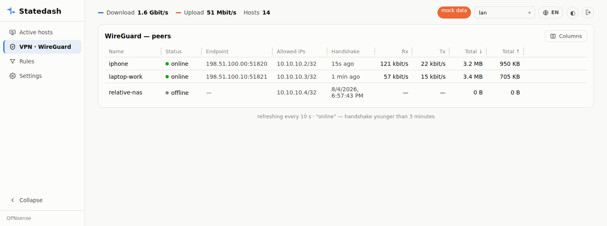
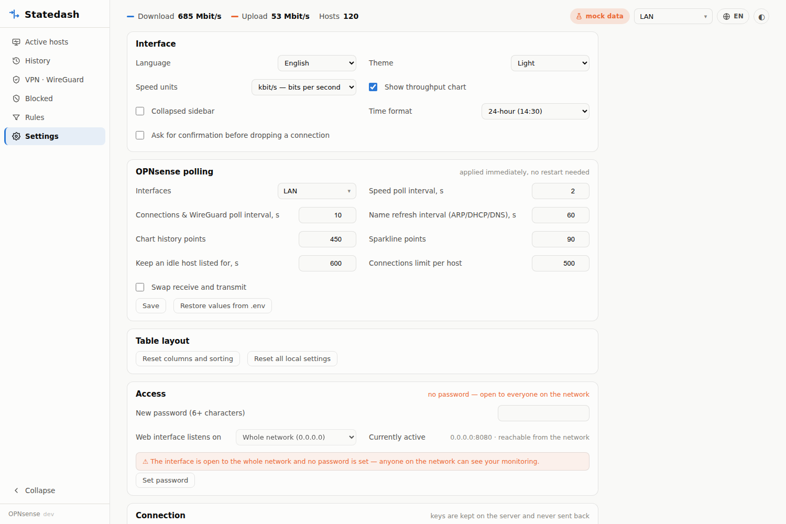

# Statedash — network monitoring for OPNsense

*English · [Русский](README.ru.md)*

A live view of your network: who is online and how much they are downloading,
where every device connects to, which firewall rules the traffic flows through
and who is connected over VPN. Nothing is installed on the firewall — the app
polls the OPNsense REST API and runs in Docker on any machine.



## Sections

### Active hosts

- Device table: name (ARP → DHCP → reverse DNS → traffic top), current receive
  and transmit rates, number of connections, IP, MAC, address type
  (DHCP/static), first seen, uptime and inactivity, activity sparkline, total
  traffic.
- Columns hidden by default (enable them with the “Columns” button): interface,
  MAC vendor, top peer, number of unique destinations, peak rates over the
  history window.
- Overall throughput chart for the last 15 minutes with a crosshair.
- Refreshes every 2 seconds.

### Host details

Clicking a row opens a bottom panel with three tabs:

- **Overview** — device card: name, IP, MAC, vendor, interface, first seen,
  rates, total traffic;
- **Connections** — a live list: direction, firewall rule, service (port +
  name), countries with flags, IPs/names/ports of both sides, gateway,
  receive/transmit, state, age. A green background means outbound to the
  Internet, red means inbound from outside, local traffic stays uncoloured.
  Filters hide connections with the firewall itself and local ones. Clicking a
  row opens an action menu: **drop the connection** (clears the pf state along
  with its paired NAT entry) or copy the addresses;
- **Histogram** — the host’s throughput over the last 15 minutes.



### Rules

A traffic map with no numbers, read left to right as the packet path itself:

    source networks → port forward (DNAT) → rules → outbound NAT (SNAT) → destination networks

Destination translation happens before the rules, source translation after
them — the same order pf uses. A NAT column is only drawn when translation
actually occurs; otherwise the link simply skips it. Hovering a node highlights
only its paths; clicking a rule lists all of its connections.

Networks that belong to the firewall are boxed together as “OPNsense
networks”. Membership is detected automatically from three sources — the
firewall's own addresses, WireGuard tunnel networks and the private networks
named in the configured rules — so a newly added subnet joins the group by
itself. Subnets that live on a WAN interface are boxed separately as “WAN
networks” — they face outwards, so they are deliberately kept out of the
internal group. Each subnet is labelled with the interface it runs on (`LAN`,
`WAN`, `WireGuard`, …), resolved from the ARP table and the WireGuard tunnels.
Each rule node lists the destination ports its connections currently use
(`443/tcp · 53/udp · …`); hovering shows the full list with service names. Below is the configured rule set (filter and outbound NAT) read from
the OPNsense API, with current usage per rule.



### VPN · WireGuard

Peers: status (a handshake younger than 3 minutes means “online”), endpoint,
allowed IPs, current rates, total traffic. Clicking a peer opens the same
detail panel: overview, connections by tunnel IP, histogram. Active peers also
appear in “Active hosts” as regular devices.



### Settings

- **Interface:** language (Russian/English), theme (system/light/dark), speed
  units (kbit/s or KB/s), time format (follow language, 24-hour or AM/PM),
  chart visibility, collapsed sidebar, confirmation before dropping a connection.
- **OPNsense polling:** interface selection with checkboxes, poll intervals for
  rates / connections / names, history depth, connection limit, swapping
  receive and transmit. Applied on the fly, without a restart.
- **Table layout:** reset columns, sorting and other local settings.
- **Access:** password (scrypt hash, session in an httpOnly cookie) and the
  listen address (this machine only / whole network).
- **Connection:** OPNsense address, TLS verification and API keys — keys are
  only ever shown masked and never sent back; new values are verified with a
  request to the firewall and applied only if it answers.



### Across the interface

Tables in every section behave the same: sorting, column reordering, resizing,
showing and hiding columns — all remembered in the browser. There is a dark
theme, two languages, a mobile layout (the first column sticks during
horizontal scrolling) and deep links: `?host=IP&tab=conns`,
`?view=rules|wg|settings`, `?theme=dark`, `?lang=en`.

## Quick start (mock data)

```sh
docker compose up -d      # → http://localhost:8080
```

With `MOCK=1` in `.env` the interface runs on generated data — no OPNsense needed.

## Connecting to OPNsense

### 1. User and privileges

**System → Access → Users → ➕** — create a user `statedash` and grant it in
*Effective Privileges*:

| Privilege | What it is for |
|---|---|
| Reporting: Traffic | per-host rates |
| Diagnostics: Show States | connections, rules, dropping connections |
| Diagnostics: ARP Table | MAC, vendor, names |
| Services: ISC DHCPv4 [legacy]: Leases | names from DHCP leases |
| Diagnostics: Network Insight | reverse DNS (PTR names) |
| VPN: WireGuard: Status | the WireGuard section |

The last three are optional: without them the corresponding data simply will
not show up.

### 2. API key

In the user’s card go to **API keys → ➕** — a file with `key` and `secret` is
downloaded.

### 3. .env

```ini
OPNSENSE_URL=https://opnsense.example.com:4443
OPNSENSE_KEY=<key>
OPNSENSE_SECRET=<secret>
IFACES=lan
TLS_VERIFY=1          # 0 for a self-signed certificate
LISTEN=127.0.0.1:8080 # 0.0.0.0:8080 to open it to the network (set a password!)
MOCK=0
```

### 4. Run

```sh
docker compose up -d --build
```

After that the interfaces, poll intervals, address and keys can be changed
right in the “Settings” section — values are stored in `data/settings.json` and
survive a rebuild of the container.

## Environment variables (.env)

| Variable | Default | What it does |
|---|---|---|
| `LISTEN` | 127.0.0.1:8080 | where the web interface listens |
| `POLL_SECONDS` | 2 | rate polling interval |
| `STATES_SECONDS` | 10 | polling interval for connections, rules and WireGuard |
| `ENRICH_SECONDS` | 60 | name refresh interval (ARP/DHCP/rDNS) |
| `DIRECTION_SWAP` | 0 | swap receive and transmit |
| `HISTORY_POINTS` | 450 | chart history points (450×2s = 15 min) |
| `SPARK_POINTS` | 90 | sparkline points |

## How it works

```
backend/app/
  main.py        — FastAPI: hosts, connections, rules,
                   WireGuard, settings, login, dropping states, static files
  poller.py      — background loops: rates (2s), names (60s), states,
                   rules and WireGuard (10s); history kept in memory
  opnsense.py    — OPNsense REST API client
  auth.py        — password (scrypt) and sessions
  settings.py    — runtime settings on top of .env (data/settings.json)
  listen_conf.py — reading and writing LISTEN in .env
  geo.py         — country by IPv4 (CC0 database, downloaded at image build)
  mock.py        — mock data generator (MOCK=1)
backend/static/  — build-free frontend (vanilla JS + canvas + SVG)
```

OPNsense endpoints in use: `diagnostics/traffic/top`,
`diagnostics/traffic/interface`, `diagnostics/firewall/query_states`,
`diagnostics/firewall/del_state`, `diagnostics/firewall/kill_states`,
`diagnostics/interface/search_arp`, `dhcpv4/leases/searchLease`,
`diagnostics/dns/reverse_lookup`, `wireguard/service/show`.

## Limitations

- **History lives in memory** (≈15 minutes for hosts, ≈75 minutes for
  WireGuard) and is lost when the container restarts — there is no long-term
  storage yet.
- **No blocks are shown**: only permitted traffic from the state table is
  visible; the firewall log is closed off by API privileges.
- **Dropping a connection** interrupts the flow right now but does not forbid
  it — the client usually reconnects.
- Plain HTTP without encryption: do not expose it to the Internet; for remote
  access a VPN is safer.

## Running as a non-root user

The container runs as uid 1000, which owns `./data` and `.env` after a normal
clone. If your account uses a different id, put yours in `.env`:

```sh
echo "PUID=$(id -u)" >> .env
echo "PGID=$(id -g)" >> .env
```

Getting this wrong fails quietly: the interface works, but settings changed in
it cannot reach the disk and are lost on restart. The Settings page shows
whether they are being saved.

Upgrading from a version that ran as root leaves a `data/settings.json` owned
by root, which the container can no longer write:

```sh
sudo chown -R "$(id -u):$(id -g)" data
```


Ideas that were considered and postponed, with the reasoning, are in
[ROADMAP.md](ROADMAP.md).

## Licence

Statedash is dual-licensed.

Free for you to run, modify and self-host under the
[GNU AGPL-3.0](LICENSE) — provided that anything you build on top of it stays
open under the same terms, including when you serve it over a network.

Shipping it inside a closed-source or permissively licensed product requires a
separate **commercial licence**: exandore@gmail.com. See
[LICENSING.md](LICENSING.md) for what falls on which side of the line, and
[CONTRIBUTING.md](CONTRIBUTING.md) before sending a merge request.

Copyright © 2026 gera-corp <exandore@gmail.com>
