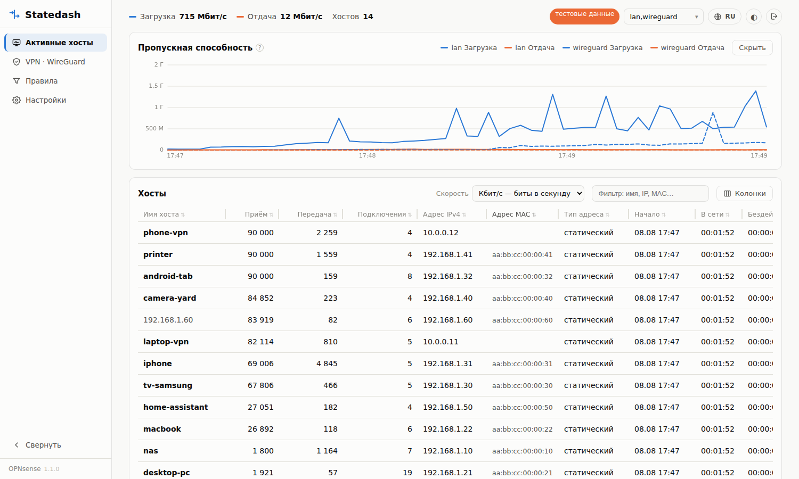
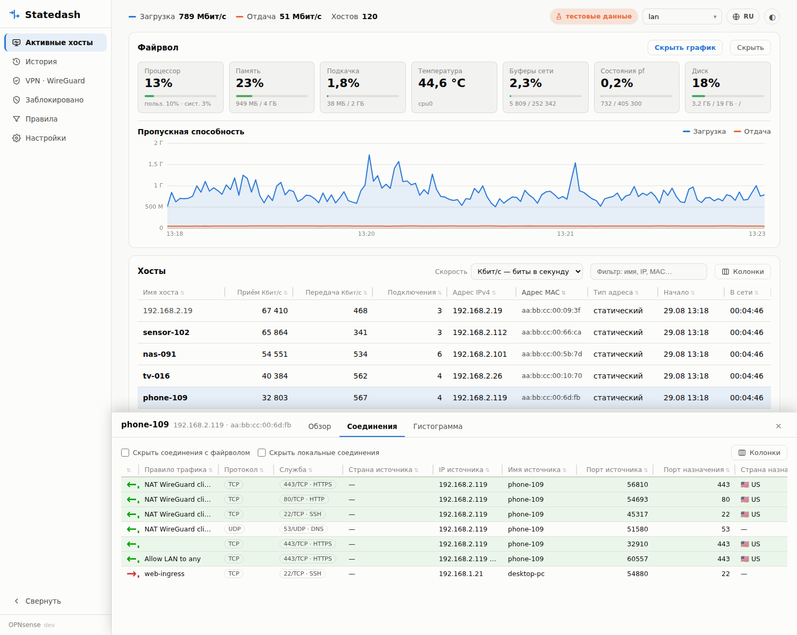
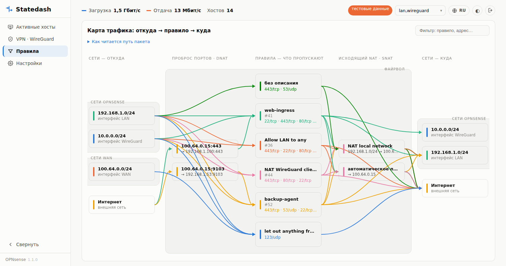
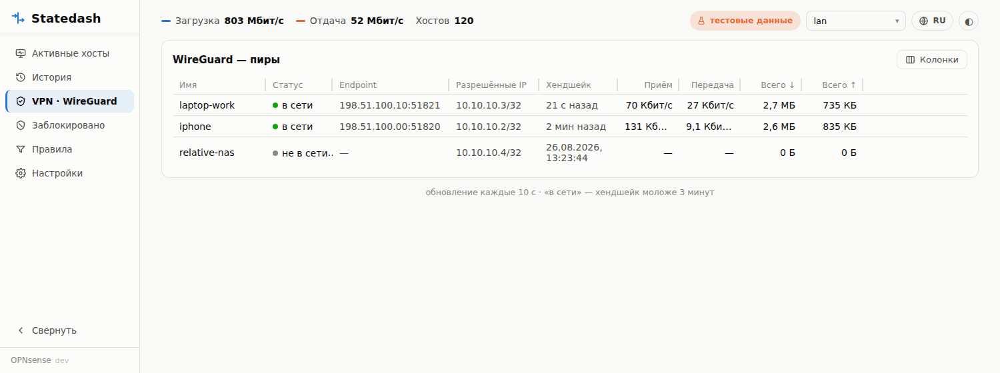
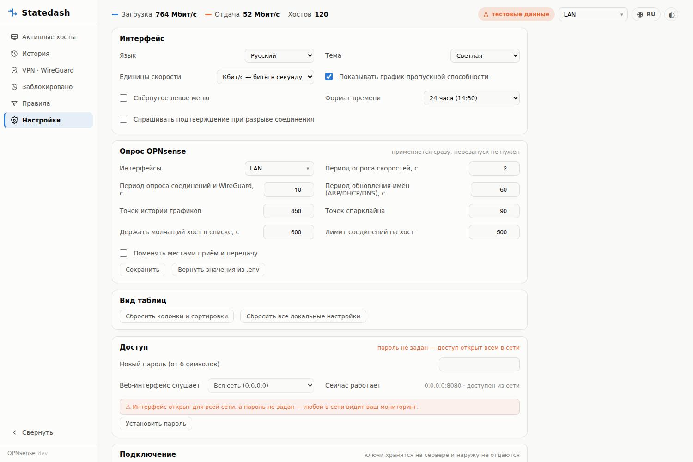

#  Statedash — мониторинг сети OPNsense

*[English](README.md) · Русский*

Живой экран сети для OPNsense: кто сейчас в сети и сколько качает, куда ходит
каждое устройство, через какие правила файрвола идёт трафик и кто подключён по
VPN. Ничего не ставится на файрвол — приложение опрашивает REST API OPNsense и
работает в Docker на любой машине.

<picture>
  <source media="(prefers-color-scheme: dark)" srcset="docs/statedash-hosts-ru-dark.png">
  
</picture>

## Разделы

### Активные хосты

- Таблица устройств: имя (ARP → DHCP → обратный DNS → traffic top), текущие
  приём и передача, число подключений, IP, MAC, тип адреса (DHCP/статический),
  когда впервые замечен, сколько в сети и сколько бездействует, спарклайн
  активности, суммарный трафик.
- Скрытые по умолчанию колонки (включаются кнопкой «Колонки»): интерфейс,
  производитель по MAC, топ-собеседник, число уникальных назначений, пиковые
  скорости за окно истории.
- Общий график пропускной способности за 15 минут с перекрестием.
- Обновление каждые 2 секунды.

### Детали хоста

Клик по строке открывает нижнюю панель с тремя вкладками:

- **Обзор** — карточка устройства: имя, IP, MAC, производитель, интерфейс,
  когда впервые замечен, скорости, суммарный трафик;
- **Соединения** — живой список: направление, правило файрвола,
  служба (порт + имя), страны с флагами, IP/имена/порты обеих сторон,
  шлюз, приём/передача, состояние, возраст. Зелёный фон — исходящие наружу,
  красный — входящие снаружи, локальные не окрашиваются. Фильтры скрывают
  соединения с самим файрволом и локальные. Клик по строке — меню действий:
  **разорвать соединение** (сбрасывает состояние pf вместе с парной NAT-записью)
  или скопировать адреса;
- **Гистограмма** — график скорости хоста за 15 минут.

<picture>
  <source media="(prefers-color-scheme: dark)" srcset="docs/statedash-connections-ru-dark.png">
  
</picture>

### Правила

Схема трафика без цифр, читается слева направо и повторяет путь пакета:

    сети-источники → проброс портов (DNAT) → правила → исходящий NAT (SNAT) → сети-назначения

Подмена назначения происходит до правил, подмена источника — после, ровно в том
порядке, в каком это делает pf. Колонка NAT появляется, только если подмена
действительно есть; иначе связь просто минует её. Наведение на узел подсвечивает
только его пути, клик по правилу — все его соединения.

Сети, которые обслуживает сам файрвол, обведены рамкой «Сети OPNsense».
Принадлежность определяется автоматически по трём источникам — собственные
адреса файрвола, туннельные сети WireGuard и приватные сети из настроенных
правил, — поэтому новая подсеть попадает в группу сама. Подсети на
WAN-интерфейсах вынесены в отдельную рамку «Сети WAN»: они смотрят наружу и
во внутреннюю группу намеренно не входят. Под каждой подсетью подписан
интерфейс, на котором она работает (`LAN`, `WAN`, `WireGuard`, …) — он
определяется по таблице ARP и по туннелям WireGuard. У каждого правила
подписаны порты назначения, по которым сейчас идут соединения
(`443/tcp · 53/udp · …`); наведение показывает весь список со службами. Ниже — настроенные
правила (фильтрация и исходящий NAT) из API OPNsense с текущей загрузкой.

<picture>
  <source media="(prefers-color-scheme: dark)" srcset="docs/statedash-rules-ru-dark.png">
  
</picture>

### VPN · WireGuard

Пиры: статус (хендшейк моложе 3 минут — «в сети»), endpoint, разрешённые IP,
текущие скорости, суммарный трафик. Клик по пиру — та же панель деталей:
обзор, соединения по туннельному IP, гистограмма. Активные пиры дополнительно
попадают в «Активные хосты» как обычные устройства.

<picture>
  <source media="(prefers-color-scheme: dark)" srcset="docs/statedash-wireguard-ru-dark.png">
  
</picture>

### Настройки

- **Интерфейс:** язык (русский/английский), тема (системная/светлая/тёмная),
  единицы скорости (Кбит/с или КБ/с), формат времени (как в языке, 24 часа или
  AM/PM), показ графика, свёрнутое меню, подтверждение при разрыве соединения.
- **Опрос OPNsense:** выбор интерфейсов списком с галочками, периоды опроса
  скоростей / соединений / имён, глубина истории, лимит соединений, обмен
  приёма и передачи. Применяется на лету, без перезапуска.
- **Вид таблиц:** сброс колонок, сортировок и остальных локальных настроек.
- **Доступ:** пароль (scrypt-хэш, сессия в httpOnly-куке), выбор адреса
  прослушивания (только эта машина / вся сеть).
- **Подключение:** адрес OPNsense, проверка TLS и ключи API — ключи
  показываются только маской и наружу не отдаются; новые значения проверяются
  запросом к файрволу и применяются, только если он ответил.

<picture>
  <source media="(prefers-color-scheme: dark)" srcset="docs/statedash-settings-ru-dark.png">
  
</picture>

### Интерфейс в целом

Таблицы во всех разделах умеют одно и то же: сортировка, перетаскивание
колонок, изменение ширины, показ и скрытие колонок — всё запоминается в
браузере. Есть тёмная тема, два языка, мобильная вёрстка (липкая первая
колонка при горизонтальной прокрутке) и deep-links:
`?host=IP&tab=conns`, `?view=rules|wg|settings`, `?theme=dark`, `?lang=en`.

## Быстрый старт (тестовые данные)

```sh
docker compose up -d      # → http://localhost:8080
```

С `MOCK=1` в `.env` интерфейс работает на сгенерированных данных — OPNsense не нужен.

## Подключение к OPNsense

### 1. Пользователь и привилегии

**System → Access → Users → ➕** — создай пользователя `statedash` и выдай в
*Effective Privileges*:

| Привилегия | Зачем |
|---|---|
| Reporting: Traffic | скорости по хостам |
| Diagnostics: Show States | соединения, правила, разрыв соединений |
| Diagnostics: ARP Table | MAC, производитель, имена |
| Services: ISC DHCPv4 [legacy]: Leases | имена из DHCP-аренд |
| Diagnostics: Network Insight | обратный DNS (имена по PTR) |
| VPN: WireGuard: Status | раздел WireGuard |

Последние три опциональны: без них соответствующие данные просто не появятся.

### 2. API-ключ

В карточке пользователя **API keys → ➕** — скачается файл с `key` и `secret`.

### 3. .env

```ini
OPNSENSE_URL=https://opnsense.example.com:4443
OPNSENSE_KEY=<key>
OPNSENSE_SECRET=<secret>
IFACES=lan
TLS_VERIFY=1          # 0 — если сертификат самоподписанный
LISTEN=127.0.0.1:8080 # 0.0.0.0:8080 — открыть в сеть (тогда задай пароль!)
MOCK=0
```

### 4. Запуск

```sh
docker compose up -d --build
```

Дальше интерфейсы, периоды опроса, адрес и ключи можно менять прямо в разделе
«Настройки» — значения сохраняются в `data/settings.json` и переживают
пересборку контейнера.

## Настройки (.env)

| Переменная | По умолчанию | Что делает |
|---|---|---|
| `LISTEN` | 127.0.0.1:8080 | где слушать веб-интерфейс |
| `POLL_SECONDS` | 2 | период опроса скоростей |
| `STATES_SECONDS` | 10 | период опроса соединений, правил и WireGuard |
| `ENRICH_SECONDS` | 60 | период обновления имён (ARP/DHCP/rDNS) |
| `DIRECTION_SWAP` | 0 | поменять местами приём и передачу |
| `HISTORY_POINTS` | 450 | точек истории графиков (450×2с = 15 мин) |
| `SPARK_POINTS` | 90 | точек спарклайна |

## Как устроено

```
backend/app/
  main.py        — FastAPI: хосты, соединения, правила,
                   WireGuard, настройки, вход, разрыв состояний, статика
  poller.py      — фоновые циклы: скорости (2с), имена (60с), состояния,
                   правила и WireGuard (10с); история в памяти
  opnsense.py    — клиент REST API OPNsense
  auth.py        — пароль (scrypt) и сессии
  settings.py    — рантайм-настройки поверх .env (data/settings.json)
  listen_conf.py — чтение и запись LISTEN в .env
  geo.py         — страна по IPv4 (база CC0, скачивается при сборке образа)
  mock.py        — генератор тестовых данных (MOCK=1)
backend/static/  — фронтенд без сборки (vanilla JS + canvas + SVG)
```

Используемые эндпоинты OPNsense: `diagnostics/traffic/top`,
`diagnostics/traffic/interface`, `diagnostics/firewall/query_states`,
`diagnostics/firewall/del_state`, `diagnostics/firewall/kill_states`,
`diagnostics/interface/search_arp`, `dhcpv4/leases/searchLease`,
`diagnostics/dns/reverse_lookup`, `wireguard/service/show`.

### Что показывает график пропускной способности

Сумму скоростей хостов на наблюдаемых интерфейсах, отдельной линией на каждый
интерфейс и направление — но **не** пропускную способность WAN. Из этого
следуют две вещи: обмен между двумя локальными хостами попадает и в загрузку, и
в отдачу, потому что это одни и те же байты, посчитанные с обоих концов; а хост,
видимый сразу на двух наблюдаемых интерфейсах, учитывается в каждом.

### Kubernetes

Helm-чарт лежит в [charts/statedash](charts/statedash):

```sh
helm install statedash oci://ghcr.io/gera-corp-org/charts/statedash \
  --set opnsense.url=https://opnsense.example.com:4443 \
  --set opnsense.existingSecret=statedash-opnsense
```

Значения и особенности запуска в Kubernetes — в его
[README](charts/statedash/README.md).

## Ограничения

- **История живёт в памяти** (≈15 минут для хостов, ≈75 минут для WireGuard) и
  обнуляется при перезапуске контейнера — долговременной базы пока нет.
- **Блокировок нет**: видно только разрешённый трафик из таблицы состояний;
  журнал файрвола закрыт правами API.
- **Разрыв соединения** прерывает поток здесь и сейчас, но не запрещает его —
  клиент обычно переподключается.
- Соединение по HTTP без шифрования: наружу выставлять не стоит, для доступа
  издалека надёжнее VPN.

Что обдумывалось и отложено — вместе с доводами — лежит в
[ROADMAP.md](ROADMAP.md).

## Запуск без прав root

Контейнер работает от uid 1000 — он же владеет `./data` и `.env` после обычного
клонирования. Если твой пользователь с другим идентификатором, укажи его в `.env`:

```sh
echo "PUID=$(id -u)" >> .env
echo "PGID=$(id -g)" >> .env
```

Ошибка здесь проявляется незаметно: интерфейс работает, но изменённые в нём
настройки не доходят до диска и теряются при перезапуске. На странице настроек
видно, сохраняются они или нет.

После обновления с версии, работавшей от root, файл `data/settings.json`
останется принадлежать root, и контейнер не сможет его перезаписать:

```sh
sudo chown -R "$(id -u):$(id -g)" data
```

## Лицензия

Statedash распространяется по двойной лицензии.

Пользоваться, изменять и разворачивать у себя можно свободно и бесплатно по
[GNU AGPL-3.0](LICENSE) — при одном условии: всё, что построено на его основе,
остаётся открытым на тех же условиях, в том числе когда доступ идёт по сети.

Чтобы встроить Statedash в закрытый продукт или в проект под разрешительной
лицензией, нужна отдельная **коммерческая лицензия**: exandore@gmail.com.
Что по какую сторону черты — в [LICENSING.md](LICENSING.md); перед
мерж-реквестом загляни в [CONTRIBUTING.md](CONTRIBUTING.md).

Copyright © 2026 gera-corp <exandore@gmail.com>
